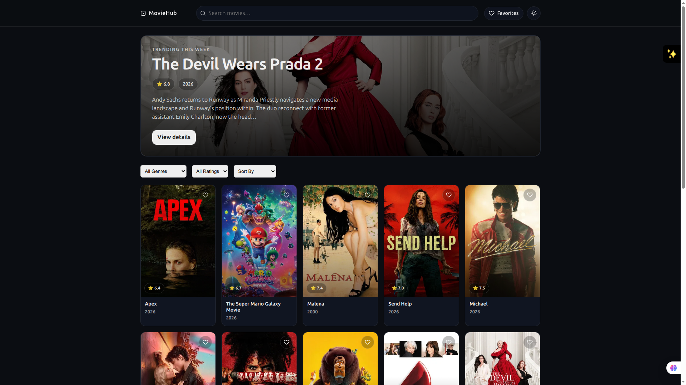
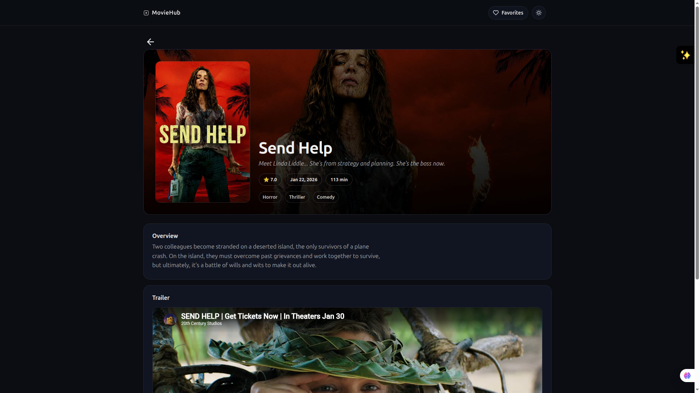
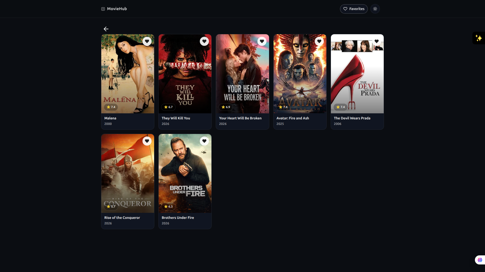

**MovieHub**

A modern movie discovery SPA built with React + Vite, focused on fast search, smooth browsing, and persistent user experience using the TMDB API.

**Features**
- Debounced movie search
- Infinite scrolling (IntersectionObserver)
- Client-side filtering & sorting
- Favorites with localStorage persistence
- Dark/light theme toggle
- Detailed movie view with trailer support

 **Tech Stack**
- React 19
- Vite
- React Router
- TMDB API
- React Context (state management)


**Getting Started**
1. Setup environment

create .env file and add
```
VITE_TMDB_KEY=your_tmdb_api_key
```

2. Run locally
```
git clone https://github.com/Addisu544/MovieHub.git
cd MovieHub
npm install
npm run dev
```
**Live Demo**
    https://moviehub544.netlify.app


## 📸 Screenshots

### Home


### Search & Filtering


### Movie Details


### Favorites
